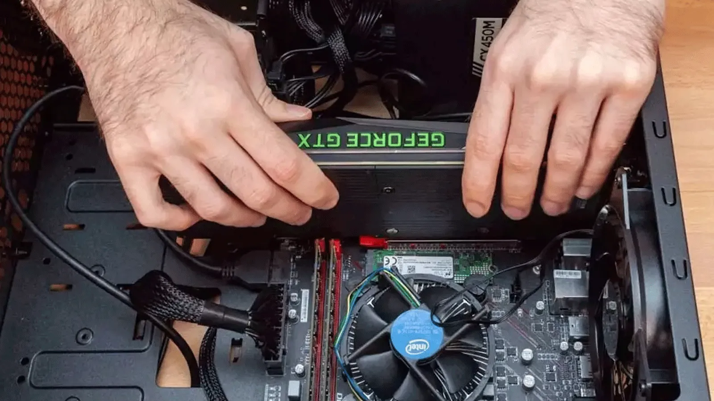

# Fitxa tècnica: Muntatge d'un ordinador de sobretaula

## Objectiu

Muntar correctament un ordinador de sobretaula instal·lant tots els components de maquinari i comprovant-ne el funcionament.

## Materials

Caixa ATX
Placa base
Processador (CPU)
Memòria RAM
Disc SSD
Font d'alimentació
Targeta gràfica (opcional)
Tornavís d'estrella
Polsera antiestàtica

## Procediment

1. Preparar la zona de treball i descarregar l'electricitat estàtica.
2. Instal·lar el processador a la placa base.
3. Col·locar el dissipador i aplicar pasta tèrmica si és necessari.
4. Instal·lar els mòduls de memòria RAM.
5. Muntar la placa base dins la caixa.
6. Instal·lar la font d'alimentació.
7. Connectar el disc SSD.
8. Instal·lar la targeta gràfica si s'utilitza.
9. Connectar els cables d'alimentació i dades.
10. Verificar totes les connexions abans d'encendre l'equip.

### Exemple de comanda

bash
lscpu
## Comprovacions

[ ] La CPU està correctament instal·lada.
[ ] La memòria RAM és reconeguda.
[ ] L'SSD apareix a la BIOS.
[ ] Tots els ventiladors funcionen.
[ ] L'ordinador arrenca correctament.

## Incidències i solucions

| Incidència | Solució |
|------------|----------|
| L'ordinador no encén | Comprovar els connectors de la font d'alimentació |
| No es detecta la RAM | Reinstal·lar els mòduls i verificar la compatibilitat |
| No hi ha imatge | Revisar les connexions de la targeta gràfica i el monitor |

## Imatge

## Recursos

https://docs.github.com/
https://www.pccomponentes.com/
https://www.markdownguide.org/